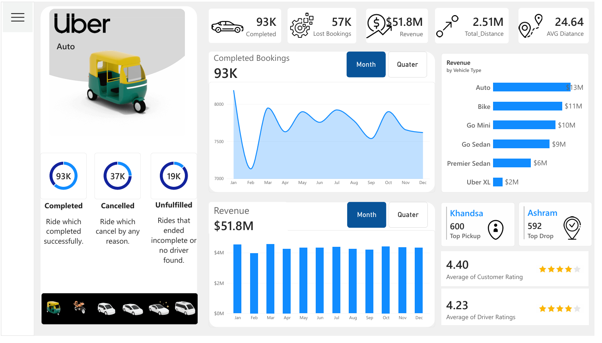

# 🚗 Uber Ride Analysis Dashboard | Power BI

An interactive Power BI dashboard that turns about 150K Uber bookings into KPIs on revenue, booking outcomes, vehicle performance, payment methods and customer/driver ratings.

## 📷 Dashboard Preview

### Overview

### Revenue

### Vehicle 

## 📊 Dataset

About 150K Uber ride bookings for one year, January to December. Key fields: booking status, vehicle type, payment method, customer ID, pickup and drop location, distance, booking value, and customer and driver ratings.

## 🗂️ Dashboard Pages

| Page | Question it answers |
| --- | --- |
| **Home** | Navigation page linking to the three analysis pages |
| **Overview** | How many bookings are completed or lost, how much revenue and distance, and how are ratings? Includes monthly and quarterly booking and revenue trends, top pickup and drop locations |
| **Revenue** | Where does revenue come from: vehicle type, payment method, top customers, and month-by-month trend |
| **Vehicle** | Drill-through page: bookings, revenue and customer count for each vehicle type, with a monthly trend per vehicle |

**Interactivity:** vehicle-type slicer, month/quarter toggles, and drill-through from the Overview to the Vehicle page.

## 💡 Key Insights

- **38% of bookings were lost.** Of about 150K bookings, 93K were completed and 57K were lost (37K cancelled, 19K incomplete or no driver found).
- **Revenue totals ₹51.8M** from completed bookings, and monthly revenue is steady at roughly ₹4.2M to ₹4.6M. February is the low point at ₹3.97M.
- **Auto and Bike lead revenue.** Auto brings in ₹12.9M (about 25%) and Bike ₹11.5M, together about 47%. Uber XL contributes ₹1.5M, under 3%.
- **UPI is the top payment method** at about ₹23M (44% of revenue), followed by Cash at ₹13M. Together they account for about 70%.
- **Ratings are healthy:** 4.40 average customer rating and 4.23 average driver rating.
- **Top pickup is Khandsa (600 bookings) and top drop is Ashram (592).**

## 🛠️ Tools & Skills

Power BI • DAX • Power Query • Data Modelling • KPI Development • Data Visualization

## 📁 Project Files

| File | Description |
| --- | --- |
| `Uber Dashboard.pbix` | Power BI source file |
| `Uber_Ride_Analysis_PowerBI_Dashboard.pdf` | PDF version of the dashboard |
| `Overview.png`, `Revenue.png`, `Vehicle.png` | Dashboard page previews |

## 👨‍💻 Author

**Sumit Mahala** · [LinkedIn](https://www.linkedin.com/in/sumit-mahala/)
