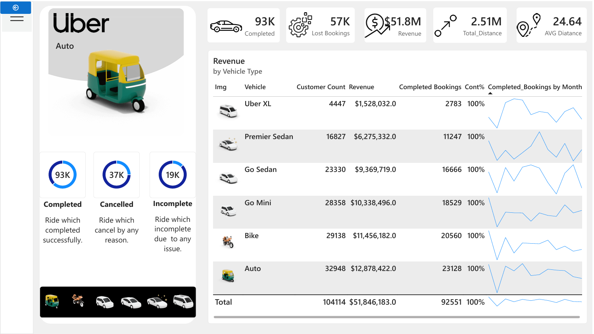
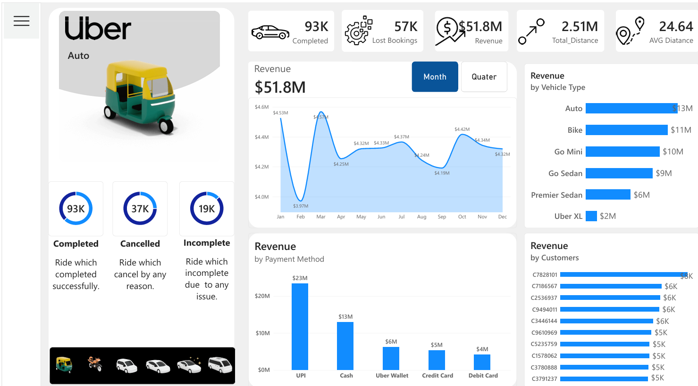

# 🚗 Uber Ride Analysis Dashboard | Power BI

An interactive Power BI dashboard developed to analyze Uber ride data and uncover meaningful business insights related to bookings, revenue, trip trends, vehicle performance, payment methods, and customer behavior.

## 📊 Project Overview

This project focuses on transforming raw Uber ride data into an interactive business intelligence dashboard using Microsoft Power BI.

The dashboard contains multiple pages that provide an overview of key performance indicators and detailed analysis of ride and revenue patterns.

## 🎯 Objectives

* Analyze Uber ride bookings and trip trends
* Track key business KPIs
* Analyze revenue and payment methods
* Compare vehicle performance
* Understand customer and booking behavior
* Identify useful trends and patterns from the data

## 🛠️ Tools & Technologies

* Power BI
* Power Query
* DAX
* Data Analysis
* Data Visualization

## 📈 Dashboard Features

* Interactive KPI cards
* Ride and booking analysis
* Revenue analysis
* Vehicle-type analysis
* Payment-method analysis
* Interactive slicers and filters
* Business-focused visualizations
* Multi-page dashboard

## 📷 Dashboard Preview

### Overview

### Vehicle

### Revenue 

## 📁 Project Files

| File                     | Description                  |
| ------------------------ | ---------------------------- |
| `Uber Dashboard.pbix` | Power BI source file         |
| `Uber_Ride_Analysis_PowerBI_Dashboard.pdf`     | PDF version of the dashboard |
| `screenshots/`           | Dashboard preview images     |

## 💡 Key Skills Demonstrated

Power BI • DAX • Power Query • Data Cleaning • Data Visualization • KPI Development • Business Analysis

## 👨‍💻 Author

**Sumit Mahala**

Aspiring Data Analyst
